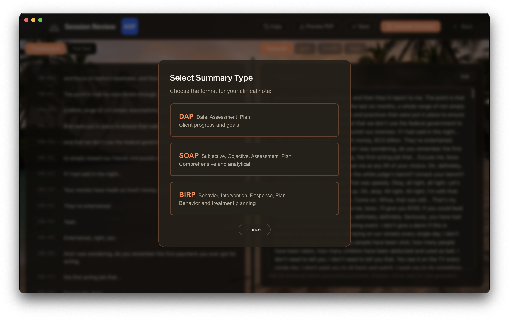
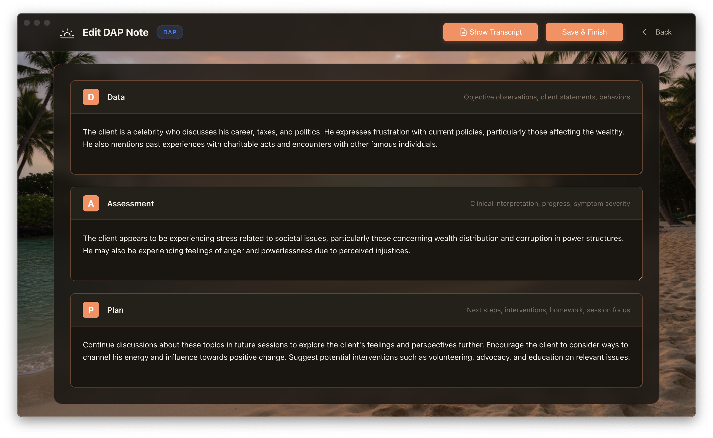
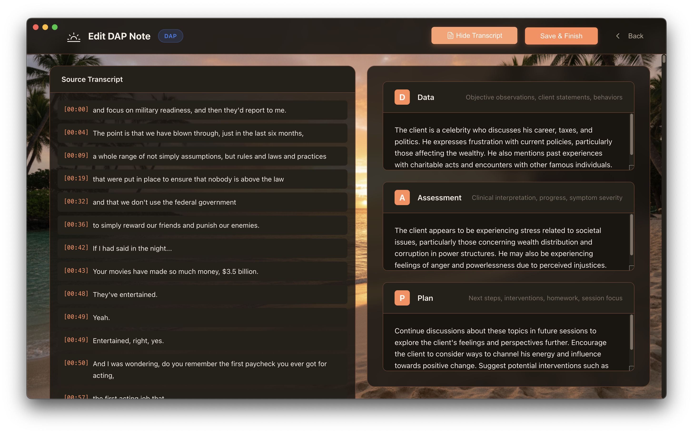

# Therapize

**Blazing-fast clinical documentation powered by your GPU.**

Record therapy sessions, transcribe in seconds, and generate polished clinical notes (DAP, SOAP, BIRP) — all running locally on your machine. No cloud uploads. No per-minute fees. No data ever leaves your computer.

  

---

## GPU-Powered AI

Therapize runs entirely on your GPU for lightning-fast transcription and note generation:

| Platform | Acceleration | Performance |
|----------|--------------|-------------|
| **Mac (Apple Silicon)** | Metal GPU | Transcribe 1-hour sessions in ~2 minutes |
| **Windows/Linux** | NVIDIA CUDA | Transcribe 1-hour sessions in ~90 seconds |

**GPU Required.** Your graphics card does the heavy lifting — no cloud APIs, no per-minute charges, no waiting. Just fast, private, local AI.

---

## Download

**[→ Download Latest Release](https://github.com/datanovaconsulting/therapize-releases/releases/latest)**

| Platform | Download | GPU |
|----------|----------|-----|
| **Windows** | `.exe` installer | NVIDIA CUDA |
| **macOS (Apple Silicon)** | `.dmg` installer | Metal (M-series) |
| **Linux** | `.AppImage` | NVIDIA CUDA |

> **Note:** macOS Intel is not supported. A GPU is required for transcription and note generation.

---

## macOS Installation

> **Important:** Therapize is an unsigned app. macOS will show a security warning the first time you open it.

### How to Open on macOS

1. Download and open the `.dmg` file
2. Drag `Therapize.app` to your Applications folder
3. **Control-click** (or right-click) on Therapize
4. Select **"Open"** from the menu
5. Click **"Open"** in the security dialog

That's it! You only need to do this once. After the first time, Therapize opens normally.

*For troubleshooting, see [MAC_TRUST.md](./MAC_TRUST.md)*

---

## Complete Workflow

### 1. Start a New Session

Enter client initials or select from your existing clients.

  

### 2. Client Session History

View all past sessions for each client with quick access to notes.

  

### 3. Record Your Session

One-click recording with live audio visualization. Works with any microphone.

<table>
<tr>
<td width="50%">

<strong>Ready to Record</strong>

</td>
<td width="50%">

<strong>Recording in Progress</strong>

</td>
</tr>
</table>

### 4. GPU-Powered Transcription

Your GPU transcribes the entire session in seconds — not minutes. No waiting, no cloud uploads, no per-minute fees.

<table>
<tr>
<td width="50%">

<strong>Recording Complete</strong>

</td>
<td width="50%">

<strong>Transcribing Audio</strong>

</td>
</tr>
</table>

### 5. Review Transcript

Review the full transcript with timestamps before generating notes.

  

### 6. Generate Clinical Notes

Choose your preferred note format: **DAP**, **SOAP**, or **BIRP**. AI generates a complete draft in seconds.

  

### 7. Edit & Refine

Edit generated notes with the source transcript alongside for reference.

<table>
<tr>
<td width="50%">

<strong>Edit DAP Note</strong>

</td>
<td width="50%">

<strong>Side-by-Side with Transcript</strong>

</td>
</tr>
</table>

### 8. Export to PDF

Print-ready PDF export with professional formatting.

  

---

## Why Therapize?

### Privacy First
- All audio and transcripts stay on your device
- No cloud API calls (except one-time model downloads)
- No internet required after setup
- HIPAA-friendly local processing

### Save Time & Money
- **$49.99/month** — less than 30 minutes of your billable time
- No per-minute transcription fees or API charges
- Generate complete notes in under 5 minutes
- Unlimited sessions, unlimited notes

### Professional Quality
- State-of-the-art Whisper speech recognition
- Smart note generation with Mistral AI
- Export-ready PDF formatting

---

## Requirements

| Platform | Requirements |
|----------|--------------|
| **Windows** | Windows 10/11, NVIDIA GPU (GTX 1060+), 16GB RAM |
| **macOS** | macOS 11+, Apple Silicon (M-series), 16GB RAM |
| **Linux** | Ubuntu 20.04+, NVIDIA GPU with CUDA, 16GB RAM |
| **Disk Space** | ~8GB for AI models (SSD recommended) |

**GPU is required.** Therapize uses your graphics card for fast, local AI processing.

---

## Auto-Updates

Therapize checks for updates automatically:
- **Windows/Linux:** One-click updates
- **macOS:** Download notification (manual install)

See [UPDATE.md](./UPDATE.md) for details.

---

## Support

Having issues? [Open an issue](https://github.com/datanovaconsulting/therapize-releases/issues) on GitHub.

---

  <strong>Stop typing during sessions. Start documenting in seconds.</strong> 
  Built with care for therapists who value privacy and their time.

